# photo-to-holly30-everyday-watercolor-journal

A watercolor journal style Skill for transforming everyday photos into simplified, atmospheric watercolor illustrations.

## Style

This Skill turns photos into loose watercolor journal illustrations with:

- simplified architectural and landscape details
- soft watercolor washes
- restrained linework
- generous negative space
- small handwritten English atmosphere notes
- reduced background complexity
- a casual travel-journal feeling

## Best for

- architecture
- pavilions
- streets
- landscapes
- mountains
- lakes and coastlines
- gardens
- everyday travel scenes
- quiet night scenes

## Aspect Ratio Rules

- Horizontal photo → 2:3 horizontal
- Square photo → 2:3 horizontal
- Vertical photo → keep the original vertical aspect ratio

## Examples

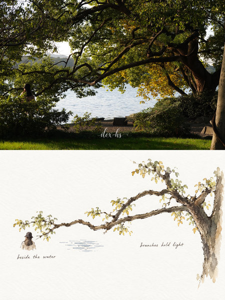

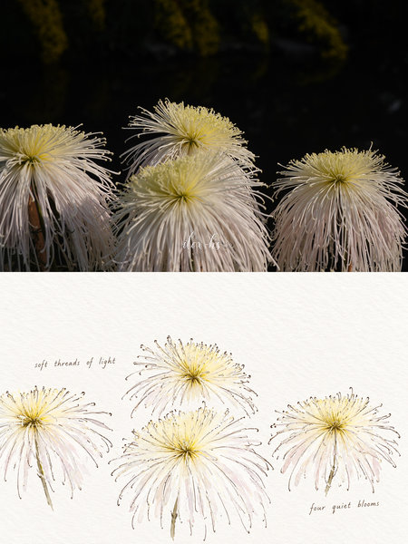

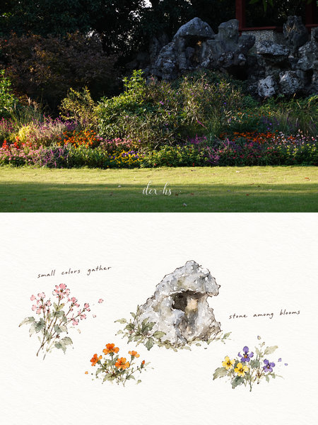

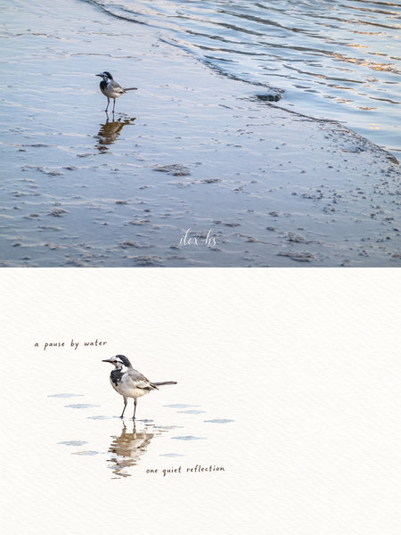

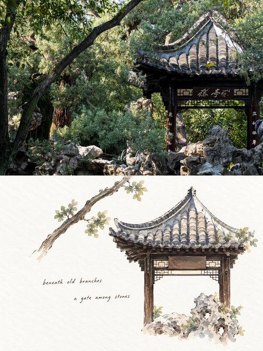

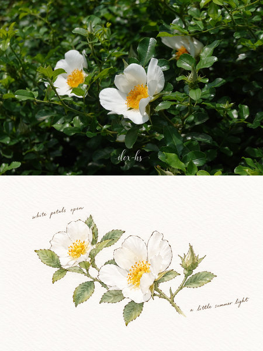

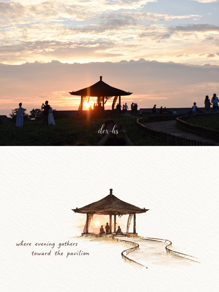

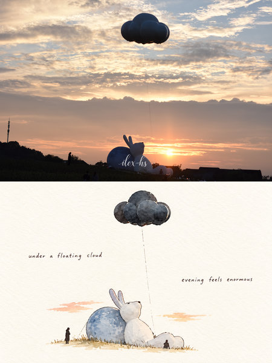

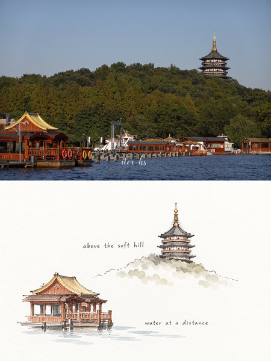

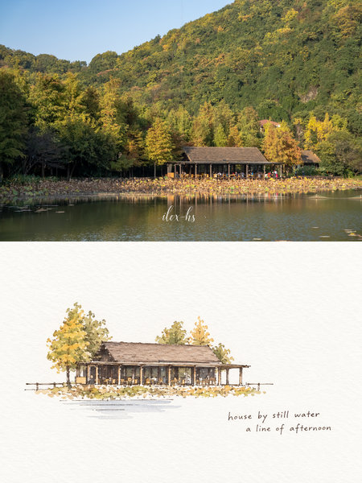

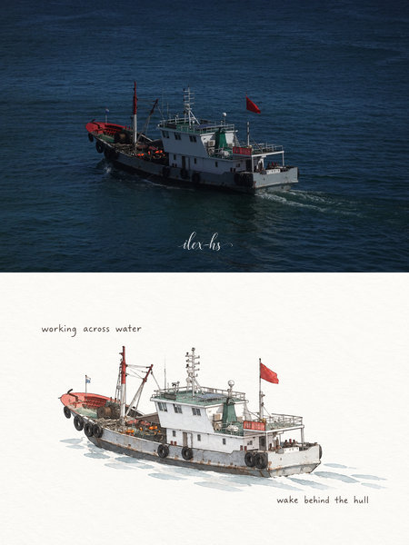

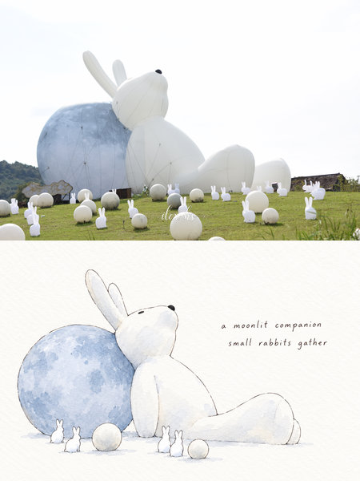

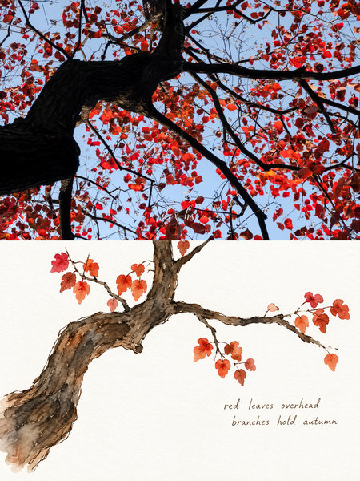

## Skill

See [`SKILL.md`](SKILL.md) for the full Skill instructions.
